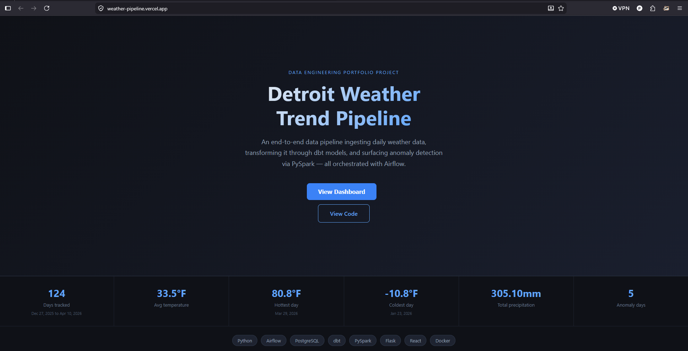
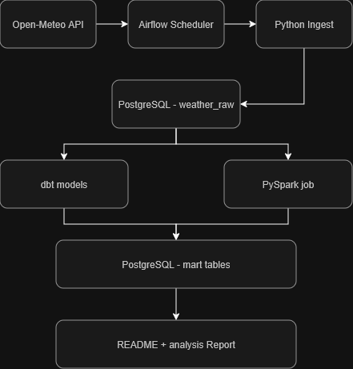

# Weather Trend Pipeline

An end-to-end data engineering pipeline that ingests daily weather data,
transforms it through multiple layers, and surfaces trend analysis + anomaly detection.

---

## Live Demo

**Frontend:** [weather-pipeline.vercel.app](https://weather-pipeline.vercel.app/) 


**Full Stack Locally:**
```bash
git clone https://github.com/patricktstormdev-droid/weather-pipeline.git
cd weather-pipeline
docker compose up -d
# Visit http://localhost:3000
```

---

## Dashboard preview


---

## Architecture
 


**Tech Stack:** Python · Airflow · PostgreSQL · dbt · PySpark · React · Docker · Vercel

**Deployment:**
- **Frontend:** Deployed to [Vercel](https://vercel.com) (free tier)
- **Backend:** Can run locally or deploy to [Render](https://render.com)
- **Code:** Hosted on [GitHub](https://github.com) with automated CI/CD via GitHub Actions

---

## Project Structure
```
weather-pipeline/
├── dags/                   # Airflow DAGs
│   └── weather_dag.py      # Daily ingest pipeline
├── ingestion/              # Python ingest scripts
│   └── fetch_weather.py    # Open-Meteo API client
├── dbt/weather/            # dbt transformation project
│   └── models/
│       ├── staging/        # stg_weather (cleaned raw data)
│       └── marts/          # weather_trends (rolling averages)
├── spark/                  # PySpark jobs
│   └── trend_analysis.py   # Anomaly detection
├── docker-compose.yml      # Full local stack definition
└── .env.example            # Required environment variables
```

---

## Pipeline Overview

1. **Ingest** - Airflow triggers a daily Python job that pulls weather data from the [Open-Meteo API](https://open-meteo.com/) (free, no API key needed) and loads it into PostgreSQL using SQLAlchemy.
2. **Store** - Raw data lands in a 'weather_raw' table in PostgreSQL with upsert logic to prevent duplicates.
3. **Transform** - dbt models clean and aggregate the raw data into two layers:
    - 'stg_weather' - cleaned, typed, and validated staging model
    - 'weather_trends' - 7-day and 30-day rolling averages
4. **Analyze** - A PySpark job computes additional rolling statistics and flags anomaly days where temperature deviates more than 2 standard deviations from the 30-day mean
5. **Orchestrate** - Airflow schedules and monitors the full pipeline on a daily cadence

---

## Sample Output

| date       | city    | temp_avg_f | rolling_7day_avg_temp_f  | is_anomaly |
|------------|---------|------------|--------------------------|------------|
| 2026-03-09 | Detroit | 55.1       | 38.4                     | true       |
| 2026-03-07 | Detroit | 58.1       | 36.2                     | true       |
| 2026-02-18 | Detroit | 40.3       | 16.9                     | true       |
| 2026-01-24 | Detroit | -1.2       | 25.2                     | true       |

---

## How To Run

### Quick Start (View Live Frontend)
```bash
# The React frontend is already deployed and live:
# https://weather-pipeline.vercel.app/dashboard
# (Just view it in your browser — no setup needed!)
```

### Full Stack Locally (All Services)

#### Prerequisites
- [Docker Desktop](https://www.docker.com/products/docker-desktop) with WSL 2 enabled
- [Git](https://git-scm.com/)
- Python 3.11+ (for running individual scripts)

#### Setup
```bash
# Clone the repo
git clone https://github.com/patricktstormdev-droid/weather-pipeline.git
cd weather-pipeline

# Copy environment file
cp .env.example .env

# Start all services (Airflow, PostgreSQL, API)
docker compose up -d

# Wait ~30 seconds for services to start
```

#### Access Services Locally

**Airflow UI** (Orchestration)
- URL: `http://localhost:8080`
- Username: `admin`
- Password: `admin`
- Trigger the `weather_ingest` DAG to run the pipeline

**Frontend** (Local)
- URL: `http://localhost:5173`
- or `http://localhost:3000` depending on your setup
- Displays weather data from your local database

**API** (Optional)
- URL: `http://localhost:8000`
- Endpoints: `/api/summary`, `/api/trends`, `/api/anomalies`

### Run Individual Components

#### Run dbt transformations
```bash
cd dbt/weather
dbt run
dbt test
```

#### Run PySpark analysis
```bash
python spark/trend_analysis.py
```

#### Ingest weather data (one-off)
```bash
python ingestion/fetch_weather.py
```

---

## Data Quality

dbt tests enforce the following rules on every run:
- `date` is never null
- `city` is never null  
- `temp_max_f` is never null
- The combination of `date` + `city` is unique across all rows

---

## What's Been Implemented 

- **Airflow DAG** with 5-task pipeline (ingest → transform → test → analyze → sync)
- **GitHub Actions CI/CD** — Auto-tests on every push
- **dbt Data Tests** — Validates data quality on every run
- **Docker Compose** — One-command local setup
- **React Frontend** — Live on Vercel
- **Flask API** — Microservice architecture
- **Git Version Control** — Full commit history

---

## What I Could Add Next

- **Grafana Dashboard** — Real-time visualization of weather trends alongside the React frontend
- **Great Expectations** — Additional data quality checks on the raw ingestion layer
- **dbt Incremental Models** — Switch from full refresh to incremental loading for efficiency at scale
- **pytest Unit Tests** — Add unit tests for fetch_weather.py and API endpoints

---

## Skills Demonstrated

**Data Engineering & Analytics:**
- Pipeline orchestration with **Apache Airflow**
- Data transformation and testing with **dbt** (data build tool)
- Large-scale data processing with **PySpark**
- Relational data modeling with **PostgreSQL**
- ETL development with **Python** (requests, pandas, SQLAlchemy)

**Web Development & DevOps:**
- Frontend development with **React** + **Vite**
- REST API design with **Flask**
- Containerization with **Docker** and **Docker Compose**
- Frontend deployment to **Vercel**
- Version control with **Git** and **GitHub**

**CI/CD & DevOps:**
- **GitHub Actions** — Automated testing on every push
- YAML workflow configuration
- Test automation (dbt tests, linting)

**Additional Skills:**
- Secret management with environment variables
- Database connection pooling and optimization
- API error handling and health checks
- CORS and frontend-backend integration
- Data quality assurance
- README documentation and project structure

---

## License

MIT