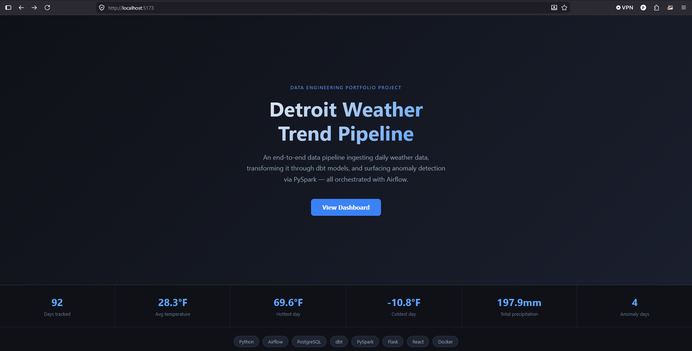

# Weather Trend Pipeline

An end-to-end data engineering pipeline that ingests daily weather data,
transforms it through multiple layers, and surfaces trend analysis + anomaly detection
all running locally via Docker.

---

## Dashboard preview


---

## Architecture


**Stack:** Python · Airflow · PostgreSQL · dbt · PySpark · Docker

---

## Project Structure
```
weather-pipeline/
├── dags/                   # Airflow DAGs
│   └── weather_dag.py      # Daily ingest pipeline
├── ingestion/              # Python ingest scripts
│   └── fetch_weather.py    # Open-Meteo API client
├── dbt/weather/            # dbt transformation project
│   └── models/
│       ├── staging/        # stg_weather (cleaned raw data)
│       └── marts/          # weather_trends (rolling averages)
├── spark/                  # PySpark jobs
│   └── trend_analysis.py   # Anomaly detection
├── docker-compose.yml      # Full local stack definition
└── .env.example            # Required environment variables
```

---

## Pipeline Overview

1. **Ingest** - Airflow triggers a daily Python job that pulls weather data from the [Open-Meteo API](https://open-meteo.com/) (free, no API key needed) and loads it into PostgreSQL using SQLAlchemy.
2. **Store** - Raw data lands in a 'weather_raw' table in PostgreSQL with upsert logic to prevent duplicates.
3. **Transform** - dbt models clean and aggregate the raw data into two layers:
    - 'stg_weather' - cleaned, typed, and validated staging model
    - 'weather_trends' - 7-day and 30-day rolling averages
4. **Analyze** - A PySpark job computes additional rolling statistics and flags anomaly days where temperature deviates more than 2 standard deviations from the 30-day mean
5. **Orchestrate** - Airflow schedules and monitors the full pipeline on a daily cadence

---

## Sample Output

| date       | city    | temp_avg_f | rolling_7day_avg_temp_f  | is_anomaly |
|------------|---------|------------|--------------------------|------------|
| 2026-03-09 | Detroit | 55.1       | 38.4                     | true       |
| 2026-03-07 | Detroit | 58.1       | 36.2                     | true       |
| 2026-02-18 | Detroit | 40.3       | 16.9                     | true       |
| 2026-01-24 | Detroit | -1.2       | 25.2                     | true       |

---

## How To Run

### Prerequisites
- [Docker Desktop](https://www.docker.com/products/docker-desktop) with WSL 2 enabled
- [Git](https://git-scm.com/)

### Setup
```bash
# Clone the repo
git clone https://github.com/patricktstormdev-droid/weather-pipeline.git
cd weather-pipeline

# Copy and fill in environment variables
cp .env.example .env

# Start the full stack
docker compose up -d
```

### Access Airflow
- URL: `http://localhost:8080`
- Username: `admin`
- Password: `admin`

### Trigger the pipeline
1. Open the Airflow UI at `localhost:8080`
2. Enable and trigger the `weather_ingest` DAG
3. Watch the task turn green

### Run dbt transformations
```bash
cd dbt/weather
dbt run
dbt test
```

### Run PySpark analysis
```bash
python spark/trend_analysis.py
```

---

## Data Quality

dbt tests enforce the following rules on every run:
- `date` is never null
- `city` is never null  
- `temp_max_f` is never null
- The combination of `date` + `city` is unique across all rows

---

## What I'd Add Next

- **Grafana dashboard** — visualize temperature trends and anomalies in real time
- **Great Expectations** — additional data quality checks on the raw ingestion layer
- **Multiple cities** — extend the pipeline to ingest weather for several cities and compare trends
- **dbt incremental models** — switch from full refresh to incremental loading for efficiency
- **CI/CD** — GitHub Actions to run `dbt test` automatically on every push

---

## Skills Demonstrated

- Pipeline orchestration with **Apache Airflow**
- Data transformation and testing with **dbt**
- Large-scale data processing with **PySpark**
- Relational data modeling with **PostgreSQL**
- Containerized local development with **Docker**
- ETL development with **Python** (requests, pandas, SQLAlchemy)
- Secret management with environment variables
- Version control with **Git**